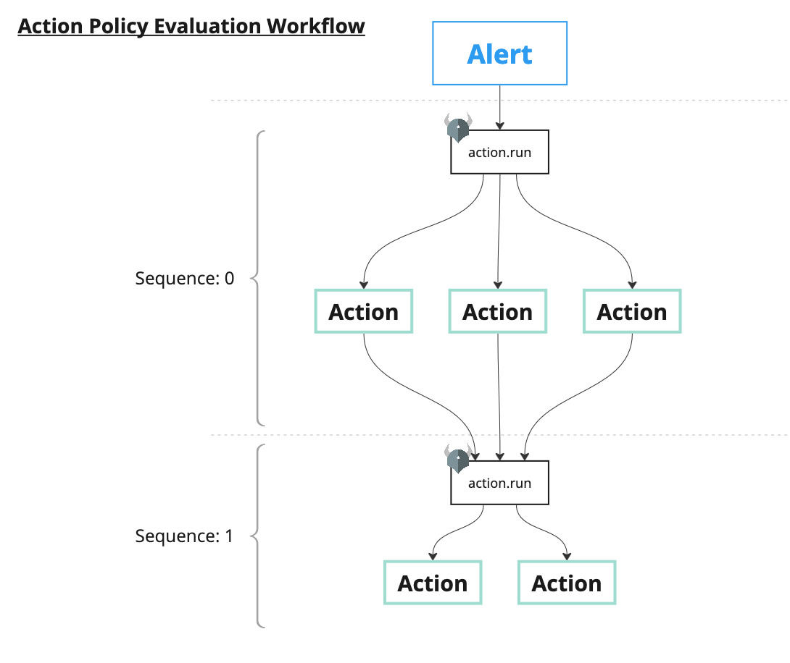

# Policy

AlertChain has two types of policies: "Alert Policy" and "Action Policy". Both policies are written in the Rego language. This document describes the input and output schemas for these policies. See the [Open Policy Agent official documentation](https://www.openpolicyagent.org/docs/latest/policy-language/) for more details on the Rego language.

The **Alert Policy** is responsible for determining whether the incoming event data from external sources should be treated as an alert. For example, when receiving notifications from external services, you may want to handle only alerts related to specific categories or exclude events that meet certain conditions (such as specific users or hosts). The Alert Policy can be used to achieve these goals by excluding certain events or including only specific events as alerts.

On the other hand, the **Action Policy** determines the appropriate response for detected alerts. For example, when an issue is detected on a cloud instance, the response may differ depending on the type of alert or the elements involved in the alert, such as stopping the instance, restricting the instance's communication, or notifying an administrator. You may also want to retrieve reputation information from external services and adjust the response accordingly. The Action Policy is responsible for defining and controlling these response procedures.

## Alert Policy

### Package

The package name for Alert Policy must follow the naming convention below:

```rego
package alert.{schema}
```

Here, `{schema}` must match the `{schema}` specified when receiving event data. For example, if the endpoint path for receiving data via Pub/Sub is `/alert/pubsub/my_alert`, the policy `package alert.my_alert` will be called.

### Input

The input for Alert Policy will be the structured data (mainly JSON) received from the previous phase. For example, if the following message is input via Google Cloud Pub/Sub:

```
{
    "message": {
        "data": "ewogICAgIm5hbWUiOiAic3VzcGljaW91c19hY3Rpb24iLAogICAgInVzZXIiOiAibS1taXp1dGFuaSIKfQo=",
    },
}
```

From the Pub/Sub schema, `message.data` is extracted, and `ewogICAgIm5hbWUiOiAic3VzcGljaW91c19hY3Rpb24iLAogICAgInVzZXIiOiAibS1taXp1dGFuaSIKfQo=` is Base64 decoded to:

```json
{
    "name": "suspicious_action",
    "user": "m-mizutani"
}
```

This data is stored in Rego's `input`. The policy will determine whether this data will be treated as an alert or not based on this data.

### Output

Once the alert determination is made, store the data with the schema below in the `alert` rule. The stored data will be treated as an alert. The output schema is according to the Alert structure.

The `attrs` field (Attribute) serves not only to extract event data fields but also to accommodate user-defined values. For instance, users can add their own `severity` key Attribute to determine the appropriate action. Attributes bind the alert and can be added or replaced by the action policy. (Refer to the Action Policy section for more details)

### Example

```rego
package alert.my_alert

alert contains msg if {
    input.name == "suspicious_action"
    msg := {
        "title": "detected suspicious action",
        "attrs": [
            {
                "key": "subject",
                "value": input.user,
            },
        ],
    }
}
```

In this example, the policy checks if the input contains the name "suspicious_action". If it does, an alert will be created with the title "detected suspicious action" and an Attribute of "subject" set to "m-mizutani".

## Action Policy

The Action Policy is invoked after an alert is detected. Alerts detected by the Alert Policy are passed to the Action Policy, which determines the appropriate action to take in response to the alert. The Action Policy controls the order of action execution, adds the results of actions to the alert, or sends requests to external services.



Specifically, the `package action` policy is called, and the `run` rule is evaluated. The `run` rule decides on the execution of actions and specifies the arguments for the actions. `run` is a collection of action execution instructions, and multiple actions can be specified at once. After all actions stored in a single evaluation are executed, AlertChain evaluates the `run` rule again. This allows multiple actions to be executed consecutively. If no actions are specified when the `run` rule is evaluated again, or only actions that have already been executed are specified, the repetition stops.

### Example

```rego
package action

run[{
    "id": "ask-chatgpt",
    "uses": "chatgpt.query",
    "args": {
        "secret_api_key": input.env.CHATGPT_API_KEY,
        "prompt": "Please analyze and summarize the given JSON-formatted security alert data, and suggest appropriate actions for the security administrator to respond to the alert:",
    },
    "commit": [
        {
            "key": "ChatGPT's comment",
            "path": "choices[0].message.content",
        }
    ]
}] {
    input.seq == 0
}
```

In this example, an action called `chatgpt.query` is launched to query the alert content to ChatGPT. The action to be launched is specified by `uses`, and the required arguments are specified by `args`. The `input.seq` value increments by 1 each time the `run` rule is called. Therefore, when the `run` rule is called for the second time, the result of `input.seq == 0` will be false, making the rule invalid, and no subsequent actions will be specified. If no actions are specified, the entire process will stop.

When the action specified in the `run` rule is executed, the Attribute specified in `commit` is added to the alert. `commit` can extract values from the action result using JSONPath or set specified data. For more details, refer to the [Policy Specification](#policy-specification). In this example, ChatGPT's comment is extracted and added to the alert with the key `ChatGPT's comment`. This is eventually used when outputting this alert to the person in charge.

Attributes added by `commit` are included in `input.alert.attrs` for the next `run` rule evaluation. They can be used for another `run` rule evaluation or as arguments for actions.

```rego
package action

run contains res if {
    input.called[_].id == "ask-chatgpt"
    res := {
        "id": "notify-slack",
        "uses": "slack.post",
        "args": {
            "secret_webhook_url": input.env.SLACK_INCOMING_WEBHOOK,
        },
    }
}
```

In the action specified by the previous `run` rule, an `id` is assigned. This `id` is a unique identifier for the action and ensures that the same action is executed only once. Information about executed actions is stored in `input.called`. Using this information, the execution order of actions can be controlled. In this example, if an action with the `id` "ask-chatgpt" has been executed, an action to notify Slack is specified to be executed.

### Repetition and `id` Specification

As mentioned earlier, the `run` rule may be evaluated multiple times. The stopping conditions are mainly three:

1. No actions are specified in the `run` rule.
2. All actions specified in the `run` rule have already been executed.
3. The repetition limit (default is 32 times) is reached.

If you do not want the same action to be executed multiple times, you can prevent multiple executions by specifying an `id` for the action. The `id` is a unique identifier for the action, and an action with the same `id` is executed only once. If an `id` is not specified, the action may be executed multiple times.

## Policy Specification

### Package Name

The package name for Action Policy must be `action`.

```rego
package action
```

### `run` Rule Specification

#### Input

An Action Policy accepts the following input:

- `input.alert`: [Alert](#alert)
- `input.env`: Map of (string, string): Map of environment variables of the AlertChain process.
- `input.seq` (number): Sequence number of actions, starting from 0.
- `input.called`: Array of [Action](#action): Actions that have already been called.

Using this input, the action policy can process the alert data and determine the most appropriate action to perform next, along with the necessary arguments and Attributes.

#### Output

After evaluating the action policy, if the next action is required, set the `action` field according to the schema of [Action](#action):

### `commit` Field Behavior

The `commit` field is used to extract the result of the action and store it in the alert. The `commit` field is an array of [Attribute](#attribute) with a `path` field. The user can choose to use JSONPath to extract the data from the action result or set specified data with the `value` field. The priority of the setting data is as follows:

- If `path` is set, AlertChain tries to extract the data from the action result using JSONPath.
  - If the JSONPath matches the result of the action, AlertChain uses the extracted data.
  - If the JSONPath does not match the result of the action,
    - If `value` is set, AlertChain uses the `value` field as the data.
    - If `value` is not set, AlertChain stores nothing.
- If `path` is not set, AlertChain uses the `value` field as the data.

## Basic Data Structures

### Alert

- `title` (string, required): Title of the alert
- `description` (string, optional): Human-readable explanation about the alert
- `source` (string, optional): Data source
- `attrs` (array, optional): Array of [Attribute](#attribute)
- `refs` (array, optional): Array of [Reference](#reference)
- `namespace` (string, optional): Namespace of Attributes (attrs). Global attributes are shared among alerts and actions that have the same namespace. If not set, the global attribute feature is not enabled.
- `data` (any): Original data of the alert
- `raw` (string): Pretty-printed JSON string of the alert data

### Attribute

- `key` (string, required): Name of the Attribute
- `value` (any, required): Value of the Attribute
- `id` (string, optional): ID of the Attribute. If not set, it will be assigned automatically.
- `type` (string, optional): Type of the Attribute
- `global`: (boolean, optional): If set to true, the Attribute will be available to all alerts and actions that have the same namespace. If set to false, the Attribute will only be available to the action that created it. Default is false.
- `ttl` (number, optional): Retention period of the Attribute in seconds. It's available only when `global` is true. Default is 86400.

Within a single alert, the `key` of an Attribute can be duplicated, but the `id` must be unique. If duplicate `id`s are provided, the Attribute specified later will overwrite the earlier one. Please note that the execution order of actions within the same sequence is not guaranteed, so caution is advised when specifying IDs to avoid duplication. If you need to modify an Attribute, you can intentionally overwrite it by specifying its ID.

### Reference

Referring to an external document or service resource via URL.

- `url`: (string, required)
- `title`: (string, optional)

### Action

- `id` (string, optional): A unique ID for the action within the alert. If not specified, it will be assigned automatically. An ID should only be executed once, so do not specify an ID for actions that need to be executed multiple times. Conversely, by explicitly specifying an `id`, you can prevent an action from being executed multiple times.
- `uses` (string, required): Specify the name of the action to be launched.
- `args`: Specify the arguments for each action in a key-value format.
- `result`: When called in the `exit` rule, the result of the action is stored.
- `force`: (boolean, optional): If set to true, the workflow will continue even if the action encounters an error. Default is false.
- `commit` (array, optional): Array of [Attribute](#attribute) with `path` field.
  - `path` (string, optional): JSONPath to extract the value from the action result.

NOTE: Arguments with the `secret_` prefix in `args` have a special meaning. This indicates that the value is confidential (e.g., API keys) and will not be output in logs or similar records.

## Global Attribute

The Global Attribute is a mechanism designed to share states between different alerts. It requires an external database to function. The databases currently supported are as follows:

- [Google Cloud Firestore](https://cloud.google.com/firestore)

### Use Cases

The Global Attribute is designed for use in the following scenarios:

- To execute specific actions only when an alert occurs a specified number of times within a certain period. For example, if there are more than 10 accesses from the same IP address, it may be considered suspicious behavior and reported as an alert. If the number of occurrences increases further, actions such as blocking may be carried out.
- To execute different actions based on the actions taken for past alerts. For example, if similar alerts occur multiple times in a short period, notifications can be suppressed or consolidated to the same destination. This can be used to aggregate multiple alerts into a single ticket in a ticket management service or to write messages within a thread rather than splitting them in a chat service, etc.

### Working Principle

Global Attributes are stored in an external database. Every time an alert is processed (Action Policy execution), AlertChain fetches the Global Attributes associated with the alert from the external database and saves any added or updated Global Attributes back to the database after processing.

Global Attributes are stored under a **namespace**. Alerts and actions within the same namespace can reference the same Global Attribute. The namespace is specified in the alert's `namespace` field. If no namespace is specified, Global Attributes cannot be used, and all related rules are ignored.

- Global Attributes are uniquely identified by a combination of a namespace and an Attribute.ID. If you try to create a Global Attribute with the same ID in the same namespace, the value will be overwritten.
- Global Attributes can have a specified TTL (Time To Live). If no TTL is specified, the default is 24 hours. Global Attributes that exceed their TTL are deleted.
- When values are overwritten, the TTL is updated.
- Alerts with the same namespace are always processed in series. That is, multiple alerts with the same namespace are never processed simultaneously. This ensures that Global Attributes are updated without conflict. However, the execution order of processes whose timing clashes is not guaranteed. The process that can acquire the lock the fastest will be executed first.

### Examples

First, you need to specify a namespace in the Alert Policy. The namespace is specified in the alert's `namespace` field.

```rego
package alert.my_alert

alert contains msg if {
    input.name == "suspicious_action"
    msg := {
        "title": "detected suspicious action",
        "namespace": "my_namespace",
    }
}
```

The namespace can be a fixed value, or it can be dynamically determined according to the content of the alert. This allows you to store different values for each target you are checking.

```rego
        "namespace": input.user,
```

Next, you will write about the Global Attribute in the Action Policy. Global Attributes are loaded just before the `init` rule is evaluated and added to the Alert's Attributes.

```rego
package action

init contains res if {
    input.alert.attrs[x].key == "called"
    input.alert.attrs[x].value == true

    res := {
        "abort": true,
    }
}
```

For example, if there is an Attribute with the key `called`, you can set `abort` to true if the value is greater than 0, thereby aborting the processing of the alert. This can be used in the `init` rule to prevent the same alert from being processed multiple times.

Here are examples of `run` and `exit`.

```rego
package action

run contains job if {
    job := {
        "id": "notify-slack",
        "uses": "slack.post",
        "args": {
            "secret_webhook_url": input.env.SLACK_INCOMING_WEBHOOK,
        },
        "commit": [
            {
                "key": "called",
                "value": true,
                "global": true,
                "ttl": 3600,
            }
        ]
    }
}
```

For `run`, you can write as usual, and of course, you can use the already loaded Global Attributes as needed. They can be used in decision conditions or as arguments for action execution.

In `commit`, you are writing the addition of Global Attributes. Here you are setting an Attribute with the key `called`, which is incorporated into the condition of the previous `init` rule. By specifying `true` in the `global` field, it is treated as a Global Attribute. The evaluation of `run` and `exit` is repeated, and at the end of all processing, only the Attributes with `global` set to `true` are saved to the database.

During this series of processes, the Action of the alert with the same namespace is not executed. Therefore, there will be no conflict within AlertChain.